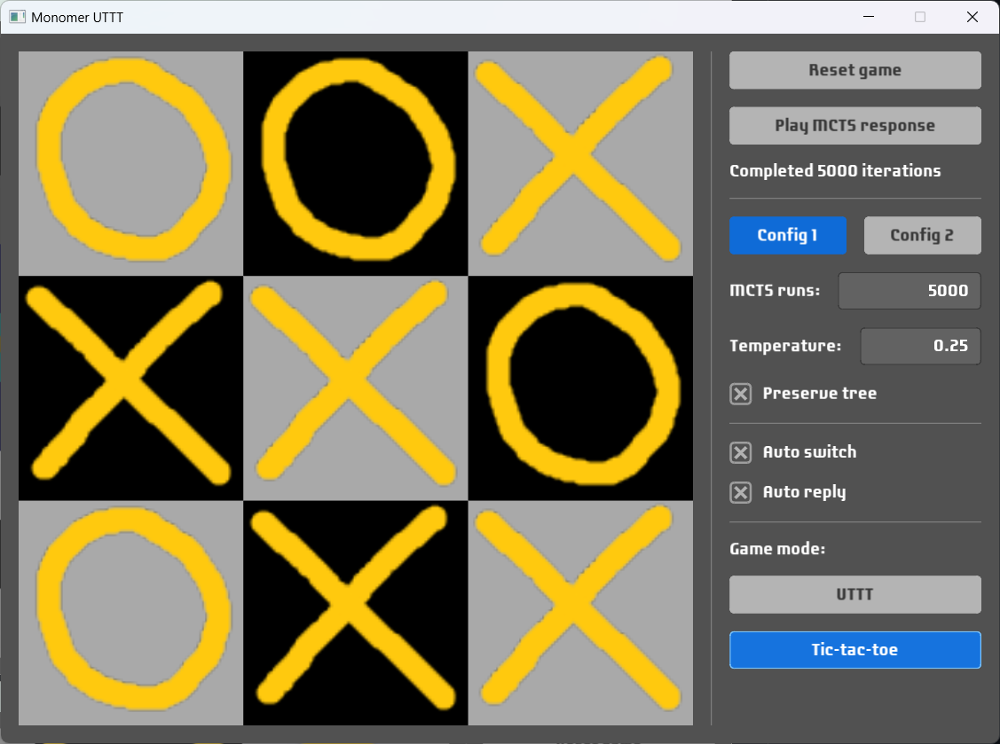

# Monomer UTTT

Haskell implementation of the [Ultimate tic-tac-toe game](https://en.wikipedia.org/wiki/Ultimate_tic-tac-toe) using [Monomer](https://github.com/fjvallarino/monomer) GUI library.

AI is implemented using [Monte Carlo tree search](https://en.wikipedia.org/wiki/Monte_Carlo_tree_search). More MCTS runs - the stronger (and slower) it plays.

It is also possible to play regular Tic-Tac-Toe.

## License
- This project is licensed under the [MIT license](LICENSE).
- This project uses [Laconic](https://www.fontsquirrel.com/fonts/laconic) font, licensed under the [SIL Open Font License](https://www.fontsquirrel.com/license/laconic).
